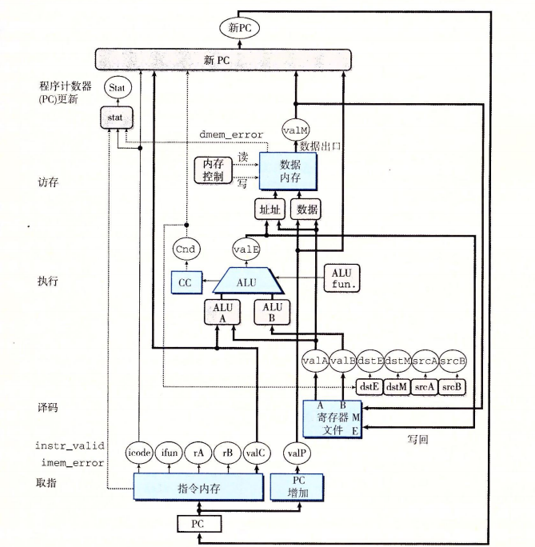
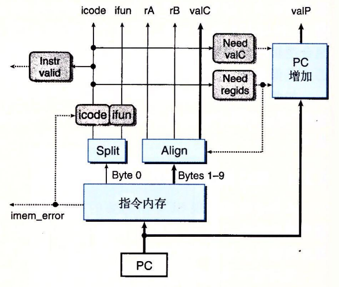

# Y86模拟器

总体架构：

指令集：

取指阶段：

译码与写回阶段：

执行阶段：

访存阶段：

PC更新：

## 注意：图源来自于《深入理解计算机系统》（CSAPP）

使用说明：

该模拟器目前提供三个接口：
void set_i_mem(vector<unsigned char> user_code)； //将程序录入指令内存

void run()； //执行

unsigned long get_result()；  //获取结果（存储在rax寄存器中）

注：因目前本项目暂未实现对应的汇编器，所以需要根据指令集录入机器代码
示例：

两数相加：

48 243 2 0 0 0 0 0 0 0  
48 240 3 0 0 0 0 0 0 0  
96 48 0 0 0 0 0 0 0 0  
0 0 0 0 0 0 0 0

example.cpp文件是一个使用实例，你可以通过这个程序读取你已经写好的机器代码执行